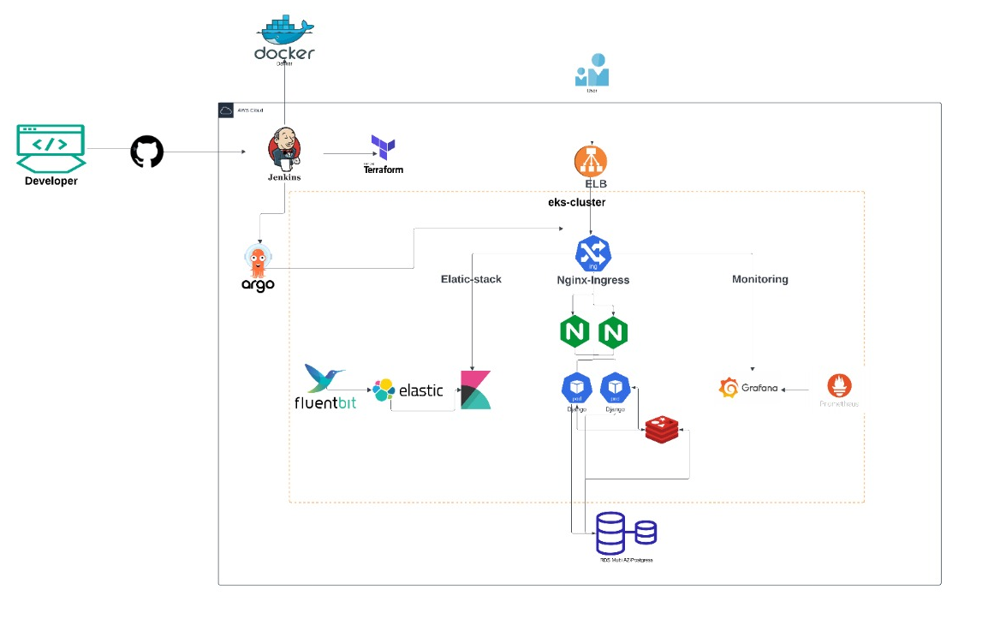

<div align="center">
    </a>
</div>
<br />
<p align="center">
    <a href="https://github.com/Status-Page/Status-Page"></a>
    <a href="https://github.com/Status-Page/Status-Page/issues"></a>
    <a href="https://github.com/Status-Page/Status-Page/network"></a>
    <a href="https://github.com/Status-Page/Status-Page/stargazers"></a>
    <a href="https://github.com/Status-Page/Status-Page/releases"></a>
    <a href="https://www.codacy.com/gh/Status-Page/Status-Page/dashboard?utm_source=github.com&amp;utm_medium=referral&amp;utm_content=Status-Page/Status-Page&amp;utm_campaign=Badge_Grade"></a>
</p>

# High Availability and Scalability Infrastructure



## Overview

This repository contains the implementation of a **highly available and scalable infrastructure** for a Django-based web application. The project is designed with modular components, using tools like **ArgoCD**, **Terraform**, **Kubernetes**, and **Jenkins CI/CD pipelines**. These components ensure resilience, scalability, and ease of deployment.

The infrastructure supports dynamic scaling, redundancy, and monitoring, making it suitable for production-grade systems.

---

## Getting Started

To deploy and operate the infrastructure, follow these simple steps:

### Step 1: Initialize Terraform for Jenkins EC2

Enter [terraform](Terraform/README.md) and follow the instructions:

### Step 2: Restore the Jenkins Backup

Enter [terraform/jenkins](Terraform/Jenkins) and follow the instructions:

---

### Step 3: Set Up ArgoCD

#### Navigate to **ArgoCD Directories**:

1. **Argo App Manager**:

   - Directory: `argo-app-manager`
   - Contains all ArgoCD application manifests for deploying resources.

2. **Argo Start**:
   - Directory: `argocd-start`
   - Key file: `my-app-of-apps.yaml`

#### Deploy the ArgoCD Application:

1. Apply the **`my-app-of-apps.yaml`** configuration:
   ```bash
   kubectl apply -f argocd-start/my-app-of-apps.yaml
   ```
